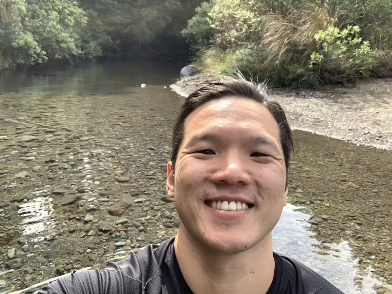
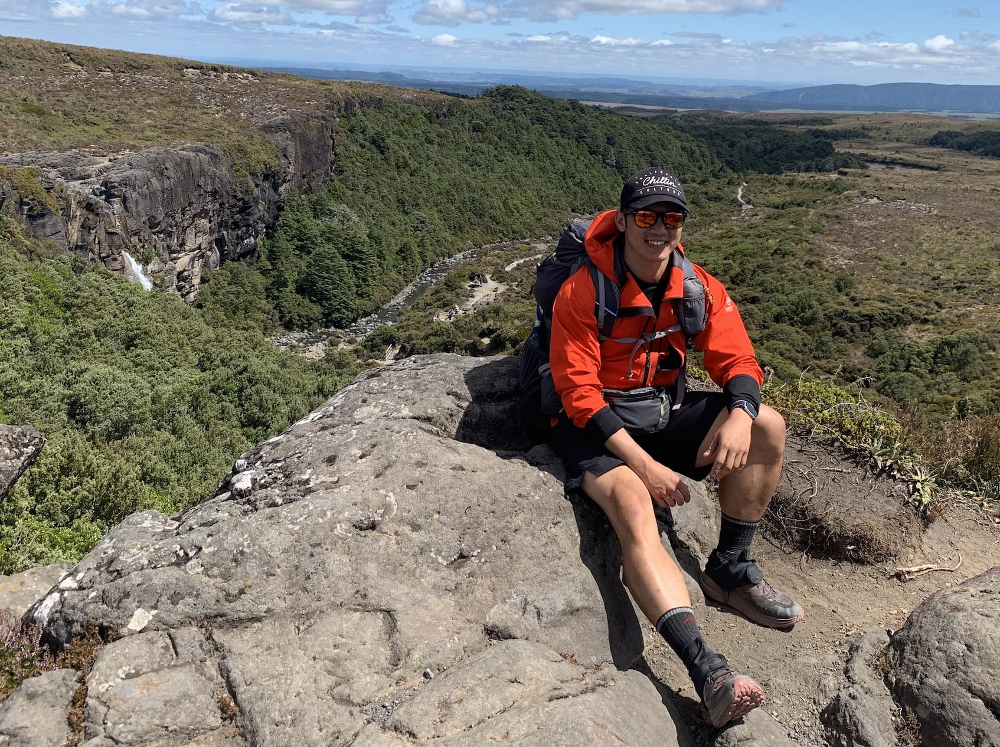
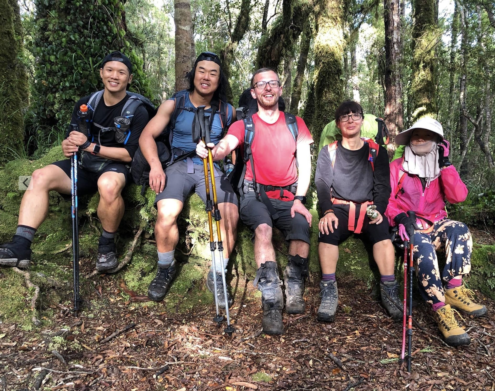

### Summary

First time thru-hiker/tramper/whatever you call it.

I am somewhere between ultralight and luxurious AF.

Been planning to do Te Araroa for awhile. The whole situation in 2020 just excaserbated it - the urge to get  out!

I am looking forward to feel the way I thought I did in these photos more often.

My goals of doing the TA are:
1. to meet and enjoy the company of the peoples of New Zealand,
2. see and feel the natural wonders of Aotearoa in person,
3. learn about the flora and fauna of the land, and
4. eat whatever I feel like for miles and miles!

I may update these goals as time goes on.
