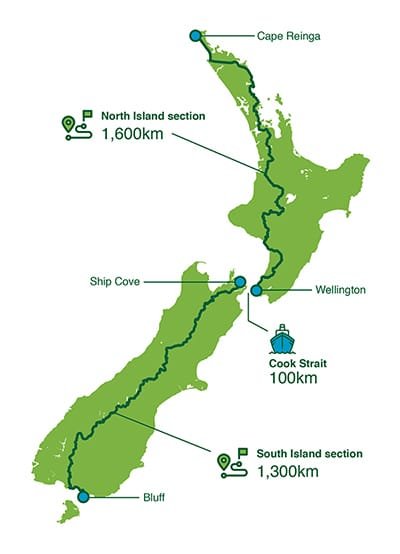

T.A. is a fairly new trail established over the two main islands of New Zealand. It about 3000 km of hiking, walking, and if you wish, kayaking and mountain biking (for some parts). 

It is managed by the [Te Araroa Trust](https://www.teararoa.org.nz/) where you can find out all about the trail.

